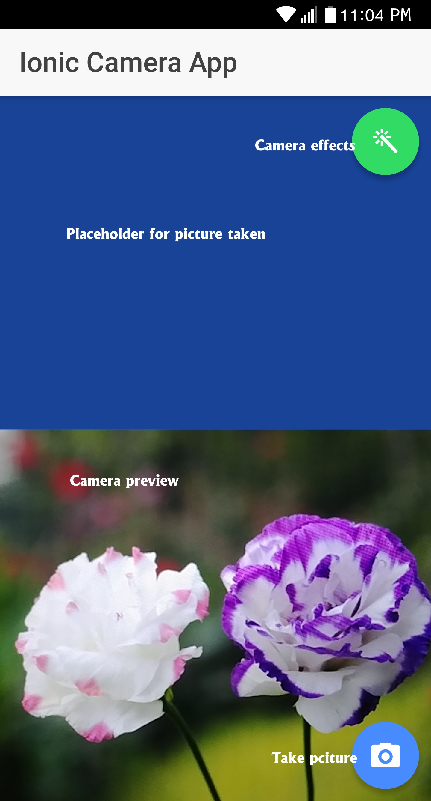

## Simpe Ionic camera app which uses Cordova and Angular to build a mobile app

 Made using [Ionic 3](https://ionicframework.com/) -which itself uses [Angular 5](https://angular.io/) to help create functional web views and [Cordova 7](https://cordova.apache.org/) to emulate Android and iOS hardware-, [NodeJS 8](https://nodejs.org/en/), and [Visual Studio Code 1](https://code.visualstudio.com/)
 
 Code is lossely based on the tutorial [How to Create a Camera App With Ionic 2](https://code.tutsplus.com/tutorials/how-to-create-a-camera-app-with-ionic-2--cms-28205)  
 The code was updated to work with Ionic 3.
 
 Screenshot of application  
 

 
 
## Clone this repo

`git clone https://github.com/mbrowniebytes/ionic-camera-app.git`

## Install packages

`npm install`  
`npm install -g cordova ionic`  

## To run on android
Install Java JDK, Android Studio as described in [Ionic's Deployment document](https://ionicframework.com/docs/intro/deploying/)  
`ionic cordova run android -lcs`  
